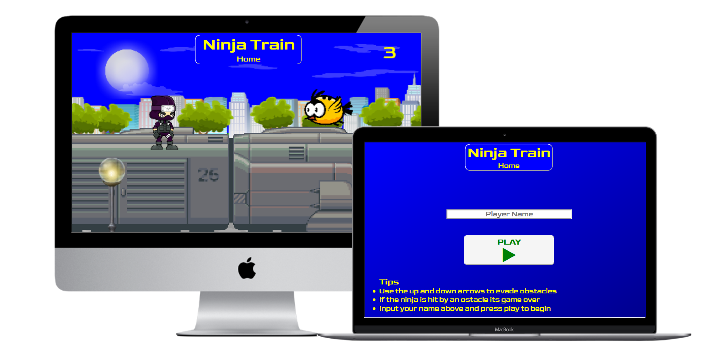

# Ninja Train

A live demo of the website can be found [here](https://dvcoffey.github.io/Ninja-Train/)

Ninja Train is a Javascript based platformer game.
Its main purpose is to proveide entertainement to the user. 

## UX

This website is designed with one main user as the focus, the gamer.

### User Stories

- As a gamer, I am looking for a new game to play. I am directed to the website via an ad or social media. 

Gamers are greeted with the homepage and logo to confirm they are in the right place.

- Now that I am on the website I would like to play a new game

The player name input will allow the gamer to input their name. This will be displayed along with the players score at the end of the game.
The play button will start a new game.

- As a gamer I want player control. 

In the game there are two controls to determine the position of the player.
These are up and down.

- As a gamer I like a challenge.

The game requires the player to dodge obstacles.
It will start slow but the game speed will gradually increase as the player progresses and become very challenging.

## Strategy
This site is primarily B2C focused, in this case the business is the Game Developer and the customer is the Gamer.
The goal is to provide the customer with an enjoyable experience.
This will include taking control of ninja, and quickly reacting to the obstacle in its path to stay alive to achieve a high score.  

## Scope
Visitors should be provided with enough information quickly to determine if this is a game that they like (or dislike).
If the Game Developer were to own an online store front, the player could be directed here at the end of the game with the hope of gaining more business.

## Structure
The Logo is always visible at the top of the page in the center and will verify for the user that they are in the right place 
This also acts as a home button which will redirect the user back to the homepage.
The title screen will appear first.
The player name input occupies the center of the title screen with the play button located just underneath.
The play button will hide the title screen. It will then show the game canvas and initialise the game.
When the game ends the game will stop and the game over screen will appear over the canvas.
The game over screen will show the player score in the center along with a button underneath to allow the player to try again.
This hide the game over screen and start the game from the beginning. 

In game the player score will be visible in the upper left of the screen.
On mobile devices, player input controls will be visible in the lower left of the screen.

## Skeleton

The wireframe planning for this project was constructed using paint.net.
Using the layers I was able to diplay objects in motion over the background

## Surface
The color scheme mainly consists of blue and yellow, I chose these colors because they have good contrast together, and are reminiscent of classic 16 bit games such as sonic the hedgehog.
The game buttons are off white so they will stand out on a blue background

## Features

#### Logo/Home Button
The logo is present at all times at the top of the page, it does not take up a large amount of space and provides the user with a link to back to the homepage at all times.

#### Name input

The player can input their name on the title screen. 
This name will then be displayed beside the player score at the end of the game.
Name entry is not required and if left empty will contain the name "Player"

#### Score

As each obstacle is evaded the player score will increase by one.

#### Game speed

As each obstacle is evaded the game speed will slowly increase, gradually making the game more difficult as time passes.

#### Player Control

The ninja can exist in two locations throughout the game, standing on top of the train or clinging to the side.
This is achieved by using event listeners to trigger either a "jump" or "drop" state for the ninja.
These states then change the y coordinates of the ninja on the canvas.

#### Sprite manipulation

The ninja sprite sheet containes multiple images of the same ninja in various positions.
HTML Canvas is then used to determine which section of the sprite sheet is drawn depending on the ninja's state.
This allows for the ninja to be 'standing' on top of the train or 'hanging' off the side for instance.  

#### Random Obstacles

An obstacle array is declared, and then two types of obstacles are defined, in this case they are a bird and a lamp.
(In the object.js file the lamp is declared as a pylon however the best artwork I could source was a lamp).
A function is declared then that will:
    - Use a random boolean generator to determine which obstacle is selected
    - Push the selected obstacle into the array
    - Determine the position and motion of the object using the canvas
    - Remove the last obstacle from the array when the array reaches a certain length
This allows for the obstacles to appear in random variety, and approach the ninja from the right side of the screen.

#### Collision Detection

Using Javascript and Html canvas a function can be triggered when two obstacles collide. 
The is handled in the handle collisions function using if statements to determine if the ninjas coordinates intersected those of the obstacles.
When a collision is detected the game will stop, and the game over screen will appear. 

#### Animation

The animation function is the core element of the the game and includes most of the game functions.
It determines the position of the foreground and background, and also pushes the game into its next frame for object motion.
The functions for handling backgound, handling forground, handling obstacles, updating ninja position, drawing ninja sprite, drawing player score and handling collisions are all nested within here.

#### Loading screen

If the player initializes the game before all of the resources are loaded, a loading screen will appear until they are.
After the conditions are met the game will start automatically

## Future ideas

Music and sound effects. These were implemented during the games production, but were later removed due to loading issues.
I could not determine where in the main js file to place an event listener to check if they were loaded and start the game, and intend to return to this in the future.

A Store front. At the end of the game the user could be directed via a link to the developer's store front where other games could be downloaded.

## Technologies used

This site is constructed primarily in HTML with HTML Canvas, CSS and Javascript. 

Font Awesome 4.7 is used to provide the icons for the player controls and game buttons.
https://fontawesome.com/v4.7.0/

Google fonts is used to provide the Goldman font that is present across the site.
https://fonts.google.com/

## Testing and Deployment

#### Title Screen

- The home screen button is created and styled in HTML and CSS. 
    
    Developer tools are then used in the broswer to determine that the home button is apparent and positioned in the right place.

- The command button and title text are created and styled.

Developer tools are used to to ensure that these are apparent and in the correct place.
The developer tools is then used to preview the screen on different devices.
In some cases these have overlapped , and so adjustments were made the the positioning of elements to suit all devices.
Links are then tested by clicking on them to verify they are working. 
If the link is not working the code is checked to ensure the correct adresss is used.

#### Game Over Screen

- The game over screen is created and styled similar to the title screen.
        
The reset button is controlled using javascript will will be covered later on.

#### Portrait Warning Screen

- A warning screen is implemented using a hidden div with CSS media query.
This will be  displayed if the users device is orientated in portrait mode
    
This could be tested in the developer tools by orientating the screen into portrait mode.
Initially this did not work as I had confused portrait and landscape modes. 
Once corrected it was found to be working.
This was further tested by deploying the site to Github Pages (covered later on.)
The warning could then be tested on a mobile device.

#### Main.js 

- There were many times during development where a javascript function was implemented, and did not work as intended.
The solution to this was found using the console.log() function in various stages of the code to track what was happening in the browser.
        
- The collision detection function was declared and implemented, but did not work.
The console log() function was added to print to the console if a collision has been detected.
The console log did print that the collision had been detected, and so the issue lay elsewhere.
The Collision detection is called in the animate function, but it was placed in the incorrect order.
This was changed and the collision dectection worked.
        
- The largest function in the project is the animate function.
At many stages during development this would cease to work as newer elements were added.
The console log was placed in the animation function at various stages to track the progress in the browser.
This allowed to track the order of events. If the console did not log an event, the issue could be located.

-Collision Hit Boxes
During development, Rectangular shapes were drawn around the ninja and obstacles so the that the hit box could be visualised.
This was later removed, as the hitboxes were working as intended.

- Asset Loading
The game experienced issues if the user clicked the play button before the game images had loaded.
The solution to this was found by placing an 'If' statement at the beginning of the animate function.
This would display a loading splash screen until the assets were ready and the game would start.
The console was also used here to print ready when the assets were loaded to test its functionality 

#### Deployment
The site was deployed to Github pages.
This was achieved by pushing the existing code to Github and navgating to the settings tab on the Github repository page.
Under the Github Pages section on this page, The master branch was selected to be hosted on Github Pages.
The given link could then be used to further test the live website.
This link was copied and pasted into the about section on the main Github repository page

#### Further Testing
At this stage the site could be tested on mobile phones. 

- Div Overlap
Overlapping divs were initially present on certain mobile screens. 
This was rectified by repositioning the divs, pushing the code to the repository and testing again on the mobile device.

### Issues Encountered

- Game Restart
If the player encountered a game over and restarted the game, there were several issues encountered.
The first was that the gamespeed did not reset, and so this variable is redeclared when the player selects the 'Try Again' button.
Another bug encountered was that the obstacles present on screen would not clear when the game was restarted.
A 'clearObstacles()' function needed to be declared in the object.js. This could then be called in the main.js file on game restart.
This was then tested and found to be working correctly. 

### Code Validation

#### HTML 
Validated at https://validator.w3.org/
Return message: Document checking completed. No errors or warnings to show.

#### CSS
Validated at https://jigsaw.w3.org/css-validator/
Return message: Congratulations! No Error Found.

#### Javascript
Javascript validated at https://jshint.com/

## Sources

### Images

## Acknowledgements

Research was conducted before the project was started to see 
The inspiration for  was found here. 

